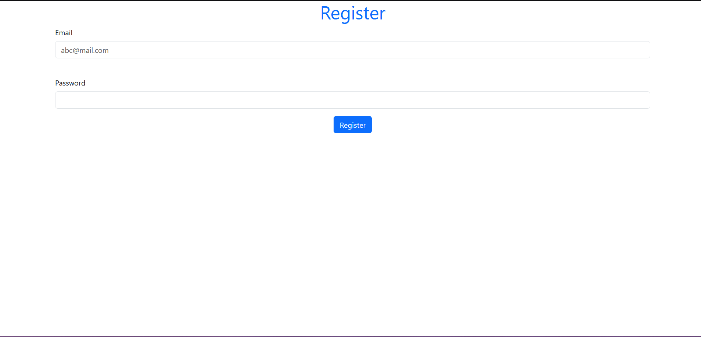
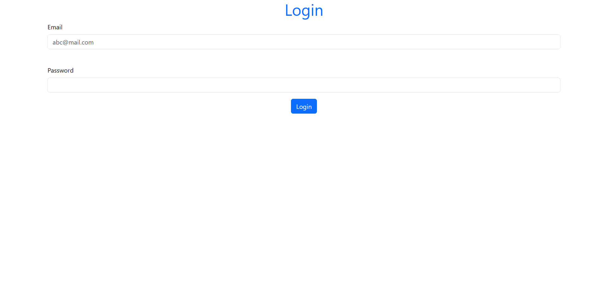
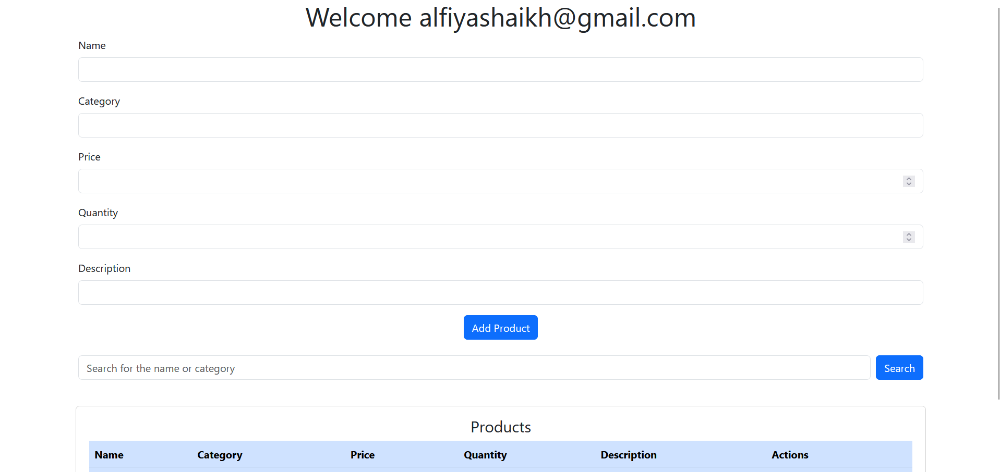
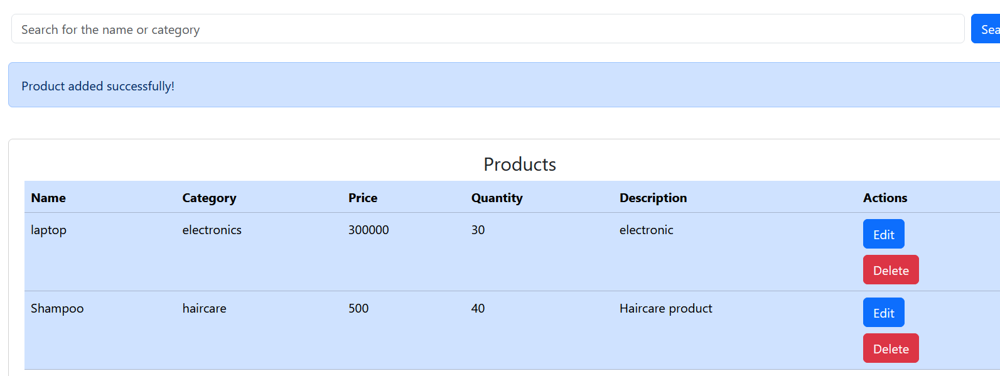
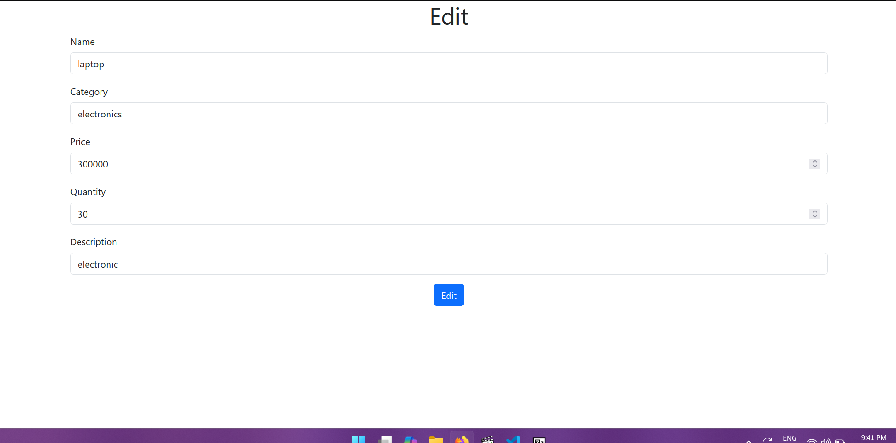
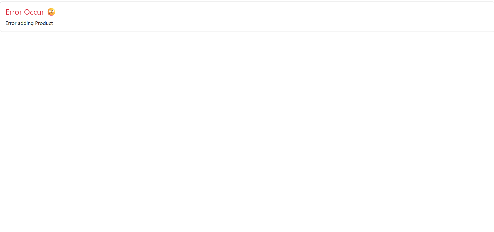

# Product Management System (MEN Stack)

A simple Product Management system built using MongoDB, Express, and Node.js. Includes session-based authentication and password hashing using `express-session` and `bcrypt`.

## Features

- User Registration & Login
- Session Management
- Password Encryption
- Add/Edit/Delete Products
- Error Handling Page
- Dashboard

## Technologies Used

- MongoDB
- Express.js
- Node.js
- EJS (View Engine)
- express-session
- bcrypt

## Screenshots

### Register Page

### Login Page

### Dashboard View

### Edit Product

### Error Page

